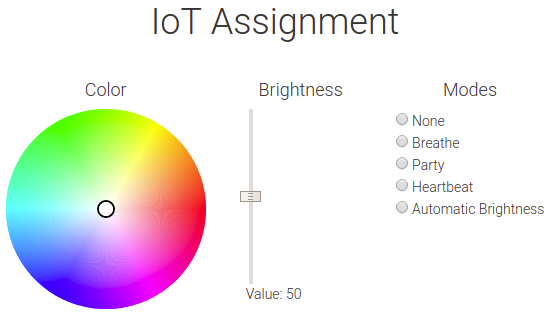

# IoT-Assignment
This is an assignment in the topic Software Engineering of Internet of Things. This is a prototype of a Smart Bulb system (Philips hue alike) by using the Pycom device LED. The application is connected through a webservice using a websocket connecting to the CloudMQTT network.

# Included features
1. Change RGB colors
2. Change Brightness
3. Automatic Brightness control based on device LUX numbers
4. Breathing and party mode

# How to run
1. Update the network SSID settings in wifi_info.py
2. Update the MQTT settings in mqtt_info.py
3. Push the Python code onto the devices using Pymakr or similar
4. Host the Web application within the web folder
5. Connect to localhost and the system is now ready
